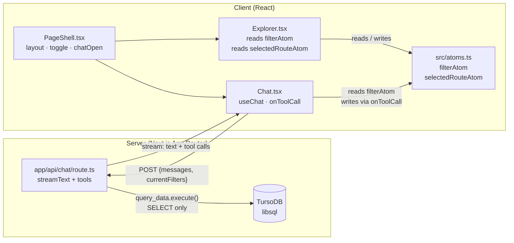
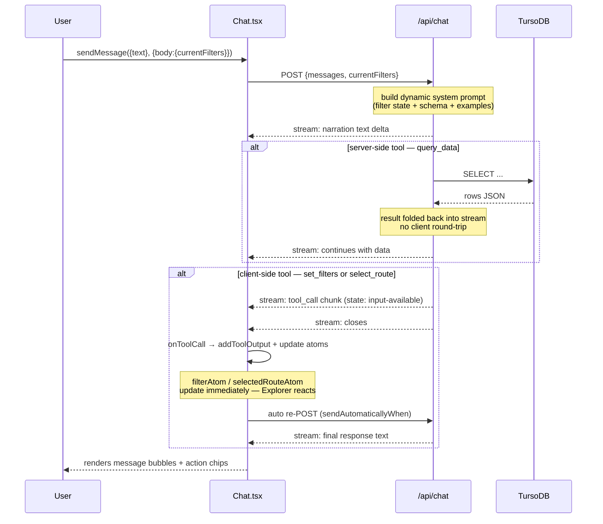

# feat: Add agent-native chat panel

## Summary

Add a persistent, collapsible chat panel to the right side of the EU AI Gateway Explorer. The panel hosts an agent (OpenRouter `openrouter/owl-alpha` via AI SDK v5) that can both query TursoDB with live SQL **and** act on the Explorer UI — applying filters, selecting routes — while narrating its reasoning as it streams. Every action a user can take through the filter controls, the agent can also take through tools.

---

## Problem Frame

The Explorer is a data-dense interface. Users who want to answer specific questions ("which Tier A route has the best throughput under $2?") must manually chain several filter interactions. A chat panel removes that friction by letting users express outcomes in natural language while the agent executes the navigation steps and explains its reasoning.

---

## Requirements

Carried from `docs/brainstorms/2026-06-09-agent-native-chat-requirements.md`.

- Right-side collapsible panel, starts open on desktop
- Agent queries TursoDB live via generated SQL (read-only)
- Agent updates Explorer filter state and selected route via client-side tools
- Agent narrates before acting: always explains intent before firing a tool
- Free OpenRouter model: `openrouter/owl-alpha`
- Dynamic context injection: current filter state included in every request
- No conversation persistence, no file attachments, no agent undo (user uses existing Reset button)

---

## Key Technical Decisions

**AI SDK v5.** The plan targets the current AI SDK (`ai` + `@ai-sdk/react`), which has a substantially different API from v4. Key differences that affect implementation: `useChat` transport setup changed (`DefaultChatTransport`), `addToolResult` renamed to `addToolOutput`, `maxSteps` replaced by `stopWhen: isStepCount(n)`, messages use `UIMessage` type, and server streaming uses `createUIMessageStreamResponse` + `toUIMessageStream` + `convertToModelMessages`.

**`@openrouter/ai-sdk-provider`.** The official community provider package, cleaner than `@ai-sdk/openai` with a custom `baseURL`. Model ID: `openrouter/owl-alpha`. Provider is instantiated with `createOpenRouter({ apiKey: process.env.OPENROUTER_API_KEY })`.

**Client-side tool loop via sequential POSTs.** Server stream closes when a no-`execute` tool fires. The client calls `addToolOutput`, then `sendAutomaticallyWhen: lastAssistantMessageIsCompleteWithToolCalls` triggers an automatic re-POST. There is no long-lived connection — the agentic loop is multiple sequential HTTP requests. `query_data` (server-side, has `execute`) loops automatically within one POST via `stopWhen: isStepCount(5)`.

**`PageShell.tsx` client wrapper.** `app/page.tsx` is a server component and cannot hold toggle state. A thin `app/PageShell.tsx` client component owns the layout split, `chatOpen` state, and the toggle button. All existing page content (Explorer, callout cards) moves inside it unchanged. `page.tsx` becomes a pure data loader that renders `<PageShell data={data} />`.

**Per-send context via `sendMessage` second arg.** Current filter state is read from `filterAtom` at send time and passed as `body: { currentFilters }` in the `sendMessage` options. This captures the live atom value at click time, not at hook init time — the correct v5 pattern for dynamic per-send data.

**`Atom.keepAlive` on all new atoms.** Module-level atom singletons, matching the existing `filterAtom` pattern. No `AtomProvider` wrapper needed. New atoms: `selectedRouteAtom: Atom<string | null>`.

**SELECT-only guard before `client.execute()`.** The libsql client does not enforce read-only mode. A `!sql.trim().toUpperCase().startsWith('SELECT')` check runs before every `withClient` call in `query_data`. Returns an error string the model can narrate; does not throw.

**No TanStack Query.** AI SDK v5's `useChat` fully manages chat message state. TanStack Query adds no value for this feature.

---

## High-Level Technical Design

### Component and data flow



### Tool execution cycle



---

## Scope Boundaries

### Deferred to follow-up work

- GROQ as fallback provider (`GROQ_API_KEY` added to env but not wired)
- Model picker UI (model is a config constant)
- Conversation persistence across page reloads
- File and image attachments
- Agent undo / filter history stack
- Highlighting rows in the coverage table (only routes via `select_route`)
- TanStack Query for data management

### Out of scope (origin doc)

- Write/mutate SQL in `query_data`
- Paid OpenRouter models or rate-limited tiers
- Authentication on the chat API route

---

## Implementation Units

### U1. Install dependencies and configure environment

**Goal:** Add AI SDK v5 packages and OpenRouter provider; update Next.js transpile config; add API key to env files.

**Requirements:** Enables all downstream units.

**Dependencies:** none

**Files:**
- `package.json`
- `next.config.ts`
- `.env.local`
- `.env.example`

**Approach:**

Install four packages:
```
ai  @ai-sdk/react  @openrouter/ai-sdk-provider  zod
```

`ai` provides server utilities (`streamText`, `tool`, `convertToModelMessages`, `createUIMessageStreamResponse`, `toUIMessageStream`, `isStepCount`, `lastAssistantMessageIsCompleteWithToolCalls`). `@ai-sdk/react` provides `useChat` and `DefaultChatTransport`. `@openrouter/ai-sdk-provider` provides `createOpenRouter`. `zod` provides tool input schemas.

In `next.config.ts`, add `"ai"` and `"@ai-sdk/react"` to `transpilePackages` alongside the existing Effect entries — both ship modern ESM that Next.js needs to transpile for the server bundle. Verify at dev start that no module resolution errors appear; if Turbopack handles them natively, remove the entries.

In `.env.local`, add `OPENROUTER_API_KEY=<value>` and `GROQ_API_KEY=<value>` (stored for future use, not wired). In `.env.example`, add both keys with empty values.

**Test expectation:** none — pure configuration. Verification: `npm run dev` starts without module resolution errors; `npm run typecheck` passes.

---

### U2. Add `selectedRouteAtom` and update `Explorer.tsx`

**Goal:** Lift the selected route ID from local component state to a shared atom so the chat agent can drive route selection.

**Requirements:** Agent parity — route selection must be reachable via tools, not only via click.

**Dependencies:** none (parallel with U1)

**Files:**
- `src/atoms.ts` — add `selectedRouteAtom`
- `app/Explorer.tsx` — replace `useState` with atom reads/writes

**Approach:**

In `src/atoms.ts`, export:
```
selectedRouteAtom = Atom.make<string | null>(null).pipe(Atom.keepAlive)
```

`keepAlive` is required — without it the atom resets when Explorer unmounts (e.g. during chat panel toggle animation).

In `Explorer.tsx`, replace the `useState<string | null>(null)` for `selectedId` with `useAtomValue(selectedRouteAtom)` (read) and `useAtomSet(selectedRouteAtom)` (write). The `setSelectedId` local reference becomes `setSelectedRouteAtom`. All downstream usages (`onSelect` prop passed to `RouteCard`, `RouteTable`, `RouteChart`; the `selected` derived value; `RouteDetail` prop) are unchanged in behavior.

**Patterns to follow:** `filterAtom` pattern in `src/atoms.ts` — module-level `Atom.make(...).pipe(Atom.keepAlive)`, consumed via `useAtomValue` / `useAtomSet` with no provider.

**Test scenarios:**
- Clicking a route card updates the detail panel (regression: identical behavior to before the atom lift)
- Clicking a different route card while the chat panel is open updates selection correctly
- (Manual) Select a route, collapse the chat panel, re-open — selection persists (keepAlive)

**Verification:** `npm run typecheck` passes; selecting a route still highlights the correct card and populates `RouteDetail`.

---

### U3. Create chat API route

**Goal:** POST endpoint that streams a narrating agent response, executing SQL server-side and emitting client-side tool calls for filter and route actions.

**Requirements:** Covers all three tools from the brainstorm; dynamic system prompt; SELECT-only guard; null guard on `withClient`.

**Dependencies:** U1

**Files:**
- `app/api/chat/route.ts` — new, first API route in the project

**Approach:**

Read `db/schema.sql` once at module level:
```
fs.readFileSync(path.join(process.cwd(), 'db/schema.sql'), 'utf-8')
```

Request body shape: `{ messages: UIMessage[], currentFilters: FilterState }`.

**System prompt** — built dynamically per request, four sections:

1. *Current state header* (from `currentFilters`):
   ```
   Current Explorer filter state:
   Tiers: A=true B=true C=false | Modes: all on | maxBlended: $8.00 | minReliability: 0
   Sort: reliability | openOnly: false | Search: ""
   ```

2. *Reset reference* (from imported `INITIAL_FILTERS`):
   ```
   Default (reset) filter state: tiers A+B on C off, all modes on, maxBlended $8, minReliability 0, sort reliability, openOnly false, search ""
   To reset: call set_filters with these exact values.
   ```

3. *Database schema* (verbatim `db/schema.sql` content)

4. *Worked examples* (three):
   - "What are the cheapest Tier A routes?" → `SELECT name, route, maker, input_price, output_price, (input_price+output_price)/2.0 AS blended FROM model_routes WHERE tier='A' ORDER BY blended ASC LIMIT 10`
   - "How many routes per tier?" → `SELECT tier, COUNT(*) AS count FROM model_routes GROUP BY tier ORDER BY tier`
   - "Show Mistral routes available on AWS Bedrock" → `SELECT mr.name, mr.tier, pc.platform, pc.requirement_fit FROM model_routes mr JOIN provider_coverage pc ON pc.model LIKE '%' || mr.name || '%' WHERE mr.maker='Mistral' AND pc.platform='AWS Bedrock' ORDER BY mr.tier`

5. *Behavioral instructions*:
   - Always explain intent before calling a tool
   - Keep responses concise and focused on EU AI sovereignty context
   - After calling `set_filters` or `select_route`, confirm what changed and why
   - Never generate SQL that modifies data (INSERT, UPDATE, DELETE, DROP, etc.)

**Tools:**

`query_data` (server-side, has `execute`):
- `inputSchema`: `z.object({ sql: z.string().describe('A read-only SELECT query') })`
- `execute`: SELECT guard → call `withClient` → null guard (return error string if null) → return first 50 rows as JSON array; catch and return error string on SQL error

`set_filters` (client-side, no `execute`):
- `inputSchema`: `z.object({ tiers: z.object({ A: z.boolean(), B: z.boolean(), C: z.boolean() }).optional(), modes: z.object({ ... }).optional(), maxBlended: z.number().min(0.1).max(8).optional(), minReliability: z.number().min(0).max(100).optional(), sort: z.enum(['reliability','blended','throughput','ttft','tier','name']).optional(), openOnly: z.boolean().optional(), search: z.string().optional() })`
- No `execute` — client handles via `onToolCall`

`select_route` (client-side, no `execute`):
- `inputSchema`: `z.object({ routeId: z.string().describe('The route id field from model_routes') })`
- No `execute` — client handles via `onToolCall`

**Stream config:**
```
model: openrouter('openrouter/owl-alpha')
messages: convertToModelMessages(messages)
system: <built above>
tools: { query_data, set_filters, select_route }
stopWhen: isStepCount(5)
```

**Response:** `createUIMessageStreamResponse({ stream: toUIMessageStream({ stream: result.stream }) })`

**Technical design (directional guidance):**
```
// SELECT guard
const trimmed = sql.trim().toUpperCase();
if (!trimmed.startsWith('SELECT')) {
  return 'Only SELECT queries are allowed.';
}
// null guard
const rows = await withClient(async (client) => {
  const result = await client.execute(sql);
  return result.rows.slice(0, 50);
});
if (rows === null) return 'Database unavailable — TURSO_DATABASE_URL not configured.';
return JSON.stringify(rows);
```

**Patterns to follow:** `withClient` helper pattern in `src/turso.ts` — import and call directly. `INITIAL_FILTERS` import from `src/atoms.ts` for reset reference.

**Test scenarios:**
- POST with `{ sql: 'SELECT name FROM model_routes LIMIT 5' }` → `query_data` returns JSON array of 5 rows
- POST with `{ sql: 'DROP TABLE model_routes' }` → `query_data` returns the error string without executing
- POST when `TURSO_DATABASE_URL` is unset → `query_data` returns "Database unavailable" string; model narrates the failure
- POST with a message "filter to Tier A routes" → response stream contains a `set_filters` tool call part with `tiers: { A: true, B: false, C: false }`
- POST with a message "what is the fastest route?" → response stream contains a `query_data` tool call part and a `select_route` tool call part
- `currentFilters` from request body appears as formatted text in the generated system prompt

**Verification:** `curl -X POST /api/chat -d '{"messages":[...],"currentFilters":{...}}'` returns a streaming response with correct `Content-Type: text/plain; charset=utf-8`.

---

### U4. Create `Chat.tsx` client component

**Goal:** Render the chat panel with streaming messages, real-time atom mutations on tool calls, and action chips showing what the agent changed.

**Requirements:** Full client-side tool execution — `set_filters` and `select_route` tool calls must update atoms before the stream continues; action chips confirm changes inline.

**Dependencies:** U1, U2, U3

**Files:**
- `app/Chat.tsx` — new client component
- `app/globals.css` — chat panel interior styles (message bubbles, action chips, input area)

**Approach:**

Component signature: `function Chat({ routes, open }: { readonly routes: ReadonlyArray<RouteView>; readonly open: boolean })`

Atom reads/writes:
```
const filters = useAtomValue(filterAtom)
const setFilters = useAtomSet(filterAtom)
const setSelectedRoute = useAtomSet(selectedRouteAtom)
```

`useChat` config:
```
transport: new DefaultChatTransport({ api: '/api/chat' })
sendAutomaticallyWhen: lastAssistantMessageIsCompleteWithToolCalls
onToolCall: async ({ toolCall }) => {
  if (toolCall.toolName === 'set_filters') {
    const patch = toolCall.input  // partial FilterState
    setFilters(f => ({
      ...f,
      ...patch,
      tiers: { ...f.tiers, ...(patch.tiers ?? {}) },
      modes: { ...f.modes, ...(patch.modes ?? {}) },
    }))
    addToolOutput({ tool: 'set_filters', toolCallId: toolCall.toolCallId, output: { applied: true } })
  }
  if (toolCall.toolName === 'select_route') {
    setSelectedRoute(toolCall.input.routeId)
    addToolOutput({ tool: 'select_route', toolCallId: toolCall.toolCallId, output: { applied: true } })
  }
}
```

`addToolOutput` must NOT be awaited — calling it synchronously is required; awaiting it causes a deadlock in the SDK.

Send handler reads live values at click time:
```
sendMessage({ text: inputValue }, { body: { currentFilters: filters } })
```

Message rendering: iterate `messages` array; for each `UIMessage`, render its parts — text parts as chat bubbles (user right, assistant left); tool-invocation parts as action chips. Chip content: derive a short label from tool name + input (e.g. `set_filters({ tiers: {A:true} })` → "Applied: Tier A only"; `select_route({ routeId })` → "Selected: [route name]"). Route name lookup: find in `routes` prop by `id`.

Input area: controlled `<input>` (or `<textarea>`), Enter key calls send handler, button also sends, disabled while `status === 'submitted' || status === 'streaming'`.

**Patterns to follow:** `filterAtom` functional updater pattern from `Explorer.tsx` — `setFilters(f => ({ ...f, ...p }))`.

**Test scenarios:**
- (Manual) Type "show only Tier A routes" → filter chips in Explorer update; action chip appears in chat
- (Manual) Type "select the fastest route" → route detail panel updates; action chip appears
- `addToolOutput` called for both tool types — stream continues after tool execution (no hang at tool call)
- Sending a message while streaming is disabled (button and Enter key do nothing when `status !== 'ready'`)
- Input clears after send
- Action chip for `select_route` shows the correct route name (looked up from `routes` prop)
- `currentFilters` in POST body reflects the atom state at send time, not at mount time

**Verification:** Chat panel renders messages; tool calls visibly update the Explorer; no TypeScript errors.

---

### U5. Create `PageShell.tsx` and update page layout

**Goal:** Wrap the full page in a client component that owns the flex split layout, chat toggle state, and toggle button.

**Requirements:** Right-side panel collapses cleanly; Explorer layout unaffected; topbar spans full width with toggle button on the right.

**Dependencies:** U2, U4

**Files:**
- `app/PageShell.tsx` — new client wrapper
- `app/page.tsx` — becomes a thin data loader
- `app/globals.css` — layout classes (`.page-root`, `.page-body`, `.page-main`, `.chat-panel`, `.chat-toggle`)

**Approach:**

`PageShell.tsx` (`"use client"`) receives the full data object currently assembled in `page.tsx` and renders all existing page content plus the chat panel. It holds `const [chatOpen, setChatOpen] = useState(true)` (desktop default; responsive CSS overrides initial state on narrow viewports).

Structure:
```
.page-root (display: flex; flex-direction: column; min-height: 100vh)
  header.topbar  (existing — add .chat-toggle button as last child, margin-left: auto)
  .page-body     (display: flex; flex: 1; overflow: hidden)
    main.page-main   (flex: 1 1 0; min-width: 0; overflow-y: auto)
      .wrap → Explorer + callout details + caption (unchanged)
    Chat (open={chatOpen} routes={data.routes})
```

CSS additions to `globals.css`:
```css
.page-root { display: flex; flex-direction: column; min-height: 100vh; }
.page-body { display: flex; flex: 1; overflow: hidden; }
.page-main { flex: 1 1 0; min-width: 0; overflow-y: auto; }
.chat-panel {
  width: var(--chat-width, 380px);
  flex-shrink: 0;
  transition: width 0.2s ease;
  overflow: hidden;
  border-left: 1px solid var(--line);
}
.chat-panel[data-closed="true"] { width: 0; border-left: none; }
.chat-toggle { margin-left: auto; /* icon button */ }
@media (max-width: 900px) {
  :root { --chat-width: 320px; }
  .chat-panel { width: 0; border-left: none; }
  .chat-panel[data-open="true"] { width: var(--chat-width); border-left: 1px solid var(--line); }
}
```

`page.tsx` simplifies to:
```
export const dynamic = 'force-dynamic';
export default async function Page() {
  const data = await loadExplorerData();
  return <PageShell data={data} />;
}
```

All JSX currently in `page.tsx` (topbar, `.wrap` contents, callout `<details>`, `ChainCard` map, caption) moves verbatim into `PageShell.tsx`.

**Patterns to follow:** `Explorer.tsx` `"use client"` boundary pattern. Existing `.topbar`, `.wrap`, and utility CSS variables (`--line`, `--core`) in `globals.css`.

**Test scenarios:**
- Toggle button opens and closes the chat panel; Explorer reflows without horizontal scroll
- All four filter presets still work with panel open
- Provider coverage section renders correctly at reduced main-column width
- On viewport < 900px: panel starts collapsed; can be toggled open
- All three `<details>` callout cards below Explorer still render and expand
- `ChainCard` list still renders inside the disclosure section

**Verification:** `npm run dev`; visually verify layout at desktop (1440px), laptop (1280px), and narrow (800px) widths. `npm run typecheck` passes.

---

## Open Questions

- **`openrouter/owl-alpha` context window and tool-call reliability** — untested at plan time. If the model refuses tool calls or produces malformed SQL, the fallback is to switch to `openrouter/auto` (one constant change in U3). Treat as an execution-time discovery.
- **`transpilePackages` necessity for `ai` and `@ai-sdk/react`** — Turbopack may handle their ESM natively. Verify at dev start in U1; remove entries if not needed.

---

## Risks and Dependencies

| Risk | Likelihood | Mitigation |
|------|-----------|-----------|
| `owl-alpha` refuses tool calls or outputs malformed SQL | Medium | Switch model constant to `openrouter/auto`; one-line change in U3 |
| OpenRouter 402 on paid-model fallback (cross-project learning) | N/A for now | `owl-alpha` is free tier; avoid paid fallback chains until the known 402 issue is investigated |
| `ai`/`@ai-sdk/react` ESM issues with Turbopack | Low | `transpilePackages` entry in U1 as pre-emptive fix |
| `withClient` null return not handled → model hallucinates results | Mitigated by design | Explicit null guard in U3 returns a string the model can narrate |
| `addToolOutput` called with `await` → stream hangs | Mitigated by design | U4 approach explicitly calls without await |

---

## Sources & Research

- Origin brainstorm: `docs/brainstorms/2026-06-09-agent-native-chat-requirements.md`
- AI SDK v5 docs (fetched during planning): `useChat`, `DefaultChatTransport`, `streamText`, client-side tools, `sendAutomaticallyWhen`, `addToolOutput`, `createUIMessageStreamResponse`
- OpenRouter docs: `openrouter/owl-alpha` model ID confirmed at `openrouter.ai/openrouter/owl-alpha`
- Cross-project learning: OpenRouter 402 issue with paid models via Vercel AI SDK (avoid paid-model chains for now)
- In-repo: `src/turso.ts` `withClient` pattern; `src/atoms.ts` `Atom.keepAlive` convention; `next.config.ts` `transpilePackages` for ESM
