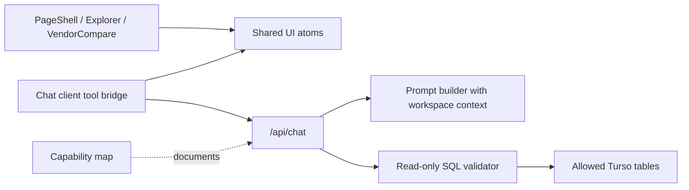

# feat: Agent-native hardening

## Overview

Close the highest-impact gaps from the agent-native architecture audit while keeping the EU LLM Explorer's core data model intentionally read-only. The work expands agent action parity across the Compare and page-shell surfaces, hardens the chat SQL read tool, injects richer workspace context, adds deterministic capability discovery commands, and records the agent capability contract.

## Problem Frame

The current chat agent can answer questions, query read-only Turso data, adjust advanced Explorer filters, and select routes. It cannot yet navigate the broader app, drive Compare state, see enough workspace context, or expose a documented capability map. SQL validation is also too weak for an agent-facing data tool because it only checks a `SELECT` prefix.

## Requirements Trace

- R1. Add agent tools for Compare state: vendor selection, model search, and matrix filters.
- R2. Add agent tools for tab/UI state, including `open_tab` and `set_ui_state`.
- R3. Decide and document persistent DB entities as intentionally read-only at runtime.
- R4. Harden `query_data` with table allowlists and stricter SQL validation.
- R5. Move filter defaults into shared constants and render prompt defaults from those constants.
- R6. Inject richer workspace context: active tab, selected route, selected vendor, visible counts, and Compare state.
- R7. Add deterministic `/help` and `/tools` chat commands.
- R8. Add tool contract tests for `query_data`, `set_filters`, and `select_route` behavior.
- R9. Reconcile route identity wording to canonical `routeId`.
- R10. Add a capability map document and require updates when UI actions change.

## Scope Boundaries

- Do not add unauthenticated runtime create/update/delete APIs for catalog tables.
- Do not mutate production/dev Turso data.
- Do not replace the existing chat UI or main Explorer/Compare layouts.
- Do not add external auth or tenant management in this pass.

## Context & Research

### Relevant Code and Patterns

- `app/api/chat/route.ts` defines the AI SDK route, dynamic system prompt, and tool schemas.
- `app/Chat.tsx` handles client-side tool outputs through `useChat`.
- `app/PageShell.tsx` owns tabs, theme, chat visibility, and selected vendor URL state.
- `app/VendorCompare.tsx` owns Compare vendor/model filter state locally today.
- `src/atoms.ts` already stores cross-component filter and selected-route state.
- `src/turso.ts`, `src/services.ts`, and `db/schema.sql` define the read data surface.

### Institutional Learnings

- Prior repo memory says the right-rail chat should remain data-grounded and preserve the existing explorer UI.
- The audit found the strongest current pattern is immediate client-side UI updates from agent tool calls through shared atoms.

### External References

- No external research required for this pass. The work follows existing AI SDK v6 and app-local patterns already present in the repo.

## Key Technical Decisions

- Treat persistent catalog/audit tables as read-only at runtime. This is safer for a public explorer and matches the existing seed-script workflow.
- Move shared UI state into atoms only where the agent needs parity with user actions. Keep purely presentational state local unless a tool must drive it.
- Keep `query_data` as a primitive read tool, but validate it with a conservative SQL guard and table allowlist before Turso execution.
- Implement slash commands deterministically before model dispatch so `/help` and `/tools` are reliable and cost-free.
- Render system prompt defaults from shared constants to avoid prompt/code drift.

## Open Questions

### Resolved During Planning

- Should DB CRUD be implemented? No. Runtime persistent data remains read-only; the decision is documented and tested through SQL guardrails.

### Deferred to Implementation

- Exact test harness details: the repo has no `test` script, so implementation should add the smallest Node/TypeScript-compatible test script that works with the current toolchain.
- Browser automation availability: `test-browser` requires `agent-browser`; if unavailable, use local Playwright/scripted smoke checks and report the limitation.

## High-Level Technical Design

> *This illustrates the intended approach and is directional guidance for review, not implementation specification. The implementing agent should treat it as context, not code to reproduce.*

## Implementation Units

- [ ] **Unit 1: Shared constants and prompt builder**

**Goal:** Centralize filter defaults, allowed SQL tables, tool descriptions, workspace context formatting, and routeId wording.

**Requirements:** R4, R5, R6, R9

**Dependencies:** None

**Files:**
- Create: `src/agent/constants.ts`
- Create: `src/agent/sql.ts`
- Modify: `src/atoms.ts`
- Modify: `app/api/chat/route.ts`
- Test: `tests/agent-sql.test.ts`

**Approach:**
- Export `INITIAL_FILTERS` from a shared location and reuse it from atoms and chat route.
- Add SQL validation that allows only single-statement reads against known catalog tables.
- Build prompt context from structured workspace inputs instead of string interpolation scattered inside the route.

**Patterns to follow:**
- Existing `src/atoms.ts` filter shape.
- Existing `app/api/chat/route.ts` tool schemas.

**Test scenarios:**
- Reject non-SELECT statements, semicolons, comments, forbidden tables, and write keywords.
- Accept basic SELECTs against allowed tables.

**Verification:**
- Prompt text and tool descriptions use canonical `routeId`.
- SQL guard returns clear errors and `query_data` uses it before Turso execution.

- [ ] **Unit 2: Agent parity for shell and Compare UI**

**Goal:** Let the agent open tabs, set UI state, and control Compare vendor/model filters.

**Requirements:** R1, R2, R6

**Dependencies:** Unit 1

**Files:**
- Modify: `src/atoms.ts`
- Modify: `app/PageShell.tsx`
- Modify: `app/Chat.tsx`
- Modify: `app/VendorCompare.tsx`
- Modify: `app/api/chat/route.ts`

**Approach:**
- Add shared atoms for active tab, compare state, and optional UI preferences needed by the agent.
- Pass workspace context from `PageShell` and `Chat` into `/api/chat`.
- Add client-side tools `open_tab`, `set_ui_state`, and `set_compare_state` with visible tool chips.

**Patterns to follow:**
- Existing `set_filters` and `select_route` client tool handling in `app/Chat.tsx`.
- Existing `selectedRouteAtom` and `filterAtom` keep-alive usage.

**Test scenarios:**
- Tool contract tests validate schemas and context shape.
- Typecheck catches invalid tab/filter/compare state wiring.

**Verification:**
- Agent can switch tabs and update Compare state without replacing current user workflows.

- [ ] **Unit 3: Capability discovery and documentation**

**Goal:** Make capabilities discoverable in-product and durable in docs.

**Requirements:** R3, R7, R10

**Dependencies:** Unit 1

**Files:**
- Create: `docs/agent-native-capability-map.md`
- Modify: `app/Chat.tsx`
- Modify: `app/api/chat/route.ts`
- Modify: `README.md`

**Approach:**
- Implement `/help` and `/tools` deterministic responses.
- Document UI actions, agent tools, read-only DB decision, and capability map maintenance rule.
- Surface the same tool vocabulary in the chat empty state.

**Patterns to follow:**
- Existing starter prompt chips in `app/Chat.tsx`.
- Existing README structure.

**Test scenarios:**
- Slash command helper returns deterministic text for `/help` and `/tools`.
- Capability map includes all implemented tools and intentional non-goals.

**Verification:**
- Users can discover what the agent can do without relying on model improvisation.

- [ ] **Unit 4: Verification and review**

**Goal:** Prove the behavior with automated checks, browser smoke, and review.

**Requirements:** R8 plus all above

**Dependencies:** Units 1-3

**Files:**
- Modify: `package.json`
- Create: `tests/agent-tools.test.ts`

**Approach:**
- Add the smallest test script compatible with the repo.
- Cover SQL guard and tool schema/context helpers.
- Run typecheck, tests, build, and a browser smoke when tooling is available.

**Patterns to follow:**
- Existing TypeScript strict settings and path aliases.

**Test scenarios:**
- `query_data`, `set_filters`, and `select_route` schemas accept valid inputs and reject invalid inputs.
- UI compiles with the new shared atoms and props.

**Verification:**
- `npm run typecheck`, `npm test`, and `npm run build` pass.

## System-Wide Impact

- **Interaction graph:** `PageShell` owns shell state, `Chat` bridges agent tools, atoms coordinate cross-component UI, API route builds prompts and runs tools.
- **Error propagation:** Invalid SQL and invalid tool inputs should return explicit tool errors instead of silently mutating state.
- **State lifecycle risks:** Compare state becomes shared and keep-alive; default/reset behavior must remain deterministic.
- **API surface parity:** New tools should be reflected in prompt text, `/tools`, and the capability map.
- **Integration coverage:** Typecheck plus tool contract tests are required because browser automation alone will not prove schema behavior.

## Risks & Dependencies

- AI SDK client-side tools rely on model-generated tool calls and client `onToolCall`; keep schemas strict and output visible.
- Adding atoms for Compare state may change default selected-vendor behavior if initialization is not careful.
- `query_data` guard must be conservative enough for safety without breaking normal catalog queries.

## Documentation / Operational Notes

- No production data migration.
- No new write surfaces for catalog data.
- Post-deploy validation should focus on `/api/chat` errors, tool-call success/error rates, and browser console errors on the chat/compare flow.

## Sources & References

- Audit summary from current SLFG invocation.
- Related code: `app/api/chat/route.ts`, `app/Chat.tsx`, `app/PageShell.tsx`, `app/VendorCompare.tsx`, `src/atoms.ts`, `src/turso.ts`, `db/schema.sql`.
