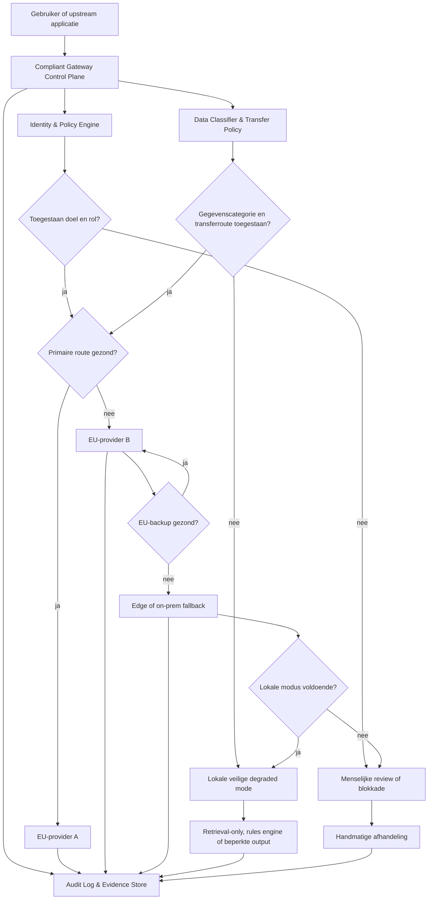
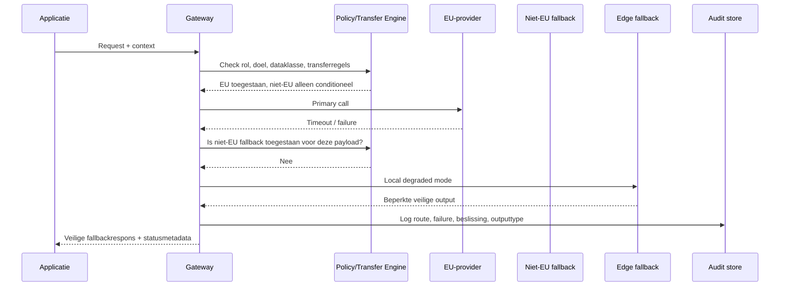
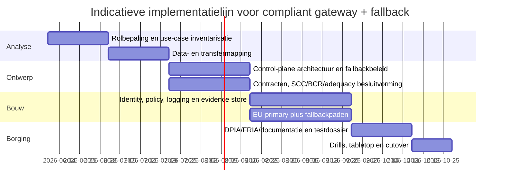

# Onderzoeksbrief over EU AI Act-conforme gateways met een altijd-beschikbare fallback

## Managementsamenvatting

Deze brief vertaalt de vraag “Europa en andere gateways die EU AI Act-compliant zijn, met een always-available fallback” naar een sector-agnostisch besluitkader voor architectuur, compliance en uitvoering. Het meegeleverde achtergrondstuk duidt op een verwante use-case rond EU-soevereine LLM-routing en failover; dit rapport generaliseert dat naar bredere `gateway`-patronen, inclusief API-, data-, research- en cloud/edge-gateways. fileciteturn0file0

De kernconclusie is dat een `gateway` onder de EU AI Act meestal géén zelfstandige wettelijke categorie is. In de AI Act en de officiële Commissie-FAQ worden de primaire rollen beschreven als onder meer `provider`, `deployer` en `provider van een general-purpose AI model`; een gateway-operator moet dus functioneel worden gemapt op die rollen. Met andere woorden: een gateway die vooral authenticatie, routing, rate limiting, filtering en logging verzorgt, is juridisch vaak vooral een technische controlelaag; een gateway die zelf AI-output genereert, de bedoelde toepassing wezenlijk wijzigt, of een derde model “verpakt” tot een nieuw AI-systeem, komt veel dichter bij de rol van `provider` uit. Dat is een juridische kwalificatievraag, niet alleen een infrastructuurvraag. citeturn21view0turn22view5turn18academia0

Voor AI Act-compliance is daarom niet de naam `gateway` doorslaggevend, maar het antwoord op vier vragen: is het systeem een AI-systeem in de zin van de Act, in welke risicocategorie valt het, wie bepaalt de intended purpose, en waar worden data en output juridisch “gebruikt” of “in de markt gezet”. De Commissie benadrukt dat de AI Act zowel binnen als buiten de EU geldt voor partijen die een AI-systeem of GPAI-model op de EU-markt brengen, in de EU in gebruik nemen, of waarvan de output in de EU wordt gebruikt. Voor persoonsgegevens komt daar het GDPR-regime voor internationale doorgiften bovenop, inclusief adequacy decisions, SCC’s, BCR’s en, waar nodig, aanvullende maatregelen. citeturn22view5turn49view1turn49view0turn50view0turn5view3

Een “always-available fallback” is niet letterlijk als zelfstandige verplichting in de AI Act uitgeschreven. Zij is wel een zeer sterke ontwerpconsequentie van eisen en verwachtingen rond robuustheid, cybersecurity, menselijk toezicht, incidentrespons, traceerbaarheid en continuïteit, zeker bij hoog-risico-toepassingen en in gereguleerde sectoren. De meest verdedigbare sector-agnostische strategie is daarom: **EU-first routing**, **policy enforcement vóór modelkeuze**, **gescheiden data-classificatie en transfer controls**, **gestructureerde logging en audit evidence**, en **een gelaagde fallback-keten** van (a) tweede EU-provider, naar (b) lokale/edge of retrieval-only modus, naar (c) menselijk of rule-based degraded mode. citeturn23view0turn23view1turn37view1turn38view0turn46view2turn46view3

Praktisch betekent dit dat de beste “compliant gateway + fallback” zelden één product is. Het is eerder een samenstel van: een identity- en policy-laag met `OAuth 2.0`/`OpenID Connect` of `SAML`, transportbeveiliging met `TLS 1.3`, lifecycle-governance met `ISO/IEC 27001` en `ISO/IEC 42001`, AI-risicobeheersing met `NIST AI RMF`, cybergovernance met `NIST CSF 2.0`, en EU-cyberpraktijken uit `ENISA` en relevante `ETSI`-standaardisatie voor telecom, IoT, edge en interoperabiliteit. Deze standaarden leveren op zichzelf geen automatische AI Act-conformiteit op, maar ondersteunen aantoonbaarheid, operationalisering en — waar geharmoniseerde normen bestaan — een sterkere compliance-positie. citeturn43view0turn42view4turn42view3turn46view2turn46view3turn41view0turn47view0turn35view0turn45view0turn21view0

De belangrijkste aanbeveling is daarom: ontwerp de gateway niet alleen als “router”, maar als **compliance control plane**. Dat houdt in: rolbepaling per use-case, risicoclassificatie per AI-functie, een transfer-matrix per fallbackpad, expliciete degraded-mode-beperkingen, contractueel afdwingbare exit- en auditrechten, en een evidence-pakket dat geschikt is voor DPIA/FRIA, technische documentatie, leveranciersdue diligence en eventuele conformity assessment. citeturn23view0turn23view1turn48view0turn49view0turn50view0

## Juridisch kader en rolbepaling

De Europese Commissie beschrijft de AI Act als een uniform, risicogebaseerd kader dat zowel voor publieke als private actoren geldt, binnen én buiten de EU, wanneer zij een AI-systeem of general-purpose AI-model op de EU-markt brengen, in de EU in gebruik nemen, of in de EU gebruiken. Research-, development- en prototypingactiviteiten vóór marktintroductie vallen buiten de regeling; systemen die exclusief voor militaire, defensie- of nationale veiligheidsdoeleinden zijn ontworpen eveneens. Voor een `research gateway` is dat relevant: een zuiver pre-market onderzoeksportaal kan buiten de AI Act vallen, maar zodra het systeem aan echte gebruikers of processen wordt aangeboden, verdwijnt die uitzondering doorgaans. citeturn21view0turn22view5

De term `gateway` komt niet terug als zelfstandige operatorcategorie in de officiële rolbeschrijving van de Commissie. In de praktijk is `gateway` daarom een technische verzamelterm voor een toegangspunt dat authenticatie, protocolvertaling, routing, filtering, policy enforcement, data-doorvoer of edge-to-cloud-bemiddeling verzorgt. Juridisch moet de gateway-operator vervolgens worden gemapt op de AI Act-rollen die wél bestaan. De meest robuuste lezing is: een eenvoudige doorvoerlaag zonder eigen AI-besluitvorming is vooral een infrastructuur- of verwerkingslaag; een gateway die AI-functionaliteit aanbiedt onder eigen regie, intended purpose bepaalt, output samenstelt of een derde model tot een eigen toepassing maakt, schuift richting `provider`; een organisatie die zo’n systeem beroepsmatig gebruikt, is eerder `deployer`. Dat is een analytische synthese van de officiële operatorbenadering en secundaire juridische literatuur, niet een expliciete wettelijke gateway-definitie. citeturn21view0turn24view2turn18academia0

De volgende tabel is daarom geen wettelijke taxonomie, maar een praktische rolmapping voor architectuur- en contractbeslissingen. Zij berust op de officiële AI Act-rolbenadering van de Commissie en op de observatie dat aansprakelijkheid en verplichtingen in de keten meebewegen met controle over doel, configuratie en marktintroductie. citeturn21view0turn23view0turn18academia0

| Gatewaytype | Praktische betekenis | Typische rol onder de AI Act | Waar de compliancevraag meestal zit |
|---|---|---|---|
| `Research gateway` | Portaal voor datasets, modellen, notebooks, compute en collaboration | Vaak buiten AI Act zolang het pre-market R&D/prototyping blijft; anders mogelijk `provider` of `deployer` | Wanneer de gateway van intern onderzoek naar externe of operationele inzet schuift |
| `API gateway` | Front door voor identity, throttling, routing, moderation en observability | Vaak infrastructuurlaag; kan `provider`-achtig worden als het de AI-dienst onder eigen naam/bedoelde toepassing levert | Transparantie, logging, vendor routing, instructions of use, incidentafhandeling |
| `Data gateway` | Doorvoerlaag voor data-extractie, filtering, tokenisatie, residency en transfer policy | Vaak geen AI-systeem op zichzelf; wel cruciaal onder GDPR en in hoog-risico data governance | Minimisatie, transfers, DPIA, logging, retention, subprocessor-beheer |
| `Cloud gateway` | Broker tussen apps en cloudmodellen of managed AI-services | Afhankelijk van samenstelling van de AI-dienst | Extraterritoriale AI Act-scope, SCC/BCR/adequacy, audit- en exitrechten |
| `Edge gateway` | Lokale bemiddeling dicht bij devices of sites | Kan `deployer`- of product/safety-component-implicaties hebben | Fail-safe gedrag, onderhoud, patching, fysieke beveiliging, latency vs governance |

Voor hoog-gereguleerde sectoren verschuift deze rolbepaling sneller richting strengere classificatie. De Commissie noemt expliciet AI-systemen die bepalen of iemand bepaalde medische behandeling krijgt, toegang tot publieke of essentiële diensten krijgt, kredietwaardigheid van natuurlijke personen beoordelen, of risico’s en prijsstelling rond levens- en zorgverzekeringen ondersteunen als voorbeelden van hoog-risicogebruik. Dat maakt het waarschijnlijker dat een gateway in health of finance niet meer als “neutrale technische laag” kan worden gezien wanneer zij beslislogica, voorselectie of output-bundeling verricht. citeturn23view0turn23view1

## Verplichtingen per risiconiveau en grensoverschrijdende datastromen

De Commissie vat de AI Act samen als een meerlagig risicomodel: een beperkte set verboden praktijken, een categorie hoog-risico-AI, specifieke transparantieverplichtingen voor bepaalde interactieve of generatieve systemen, regels voor GPAI-modellen, en daarbuiten een grote groep systemen die in beginsel onder bestaand recht vallen zonder aanvullende AI Act-verplichtingen. Belangrijk voor gateway-architectuur is daarom dat niet één gateway “de” compliance-status heeft; de relevante status wordt per AI-functie, intended purpose en gebruikscontext bepaald. citeturn21view0

Voor hoog-risico-systemen moet de `provider` vóór marktintroductie of ingebruikname een conformity assessment uitvoeren. Volgens de Commissie dekt die beoordeling onder meer risicobeheer, datakwaliteit, documentatie en traceerbaarheid, transparantie, menselijk toezicht, accuracy, cybersecurity en robustness. De beoordeling moet opnieuw gebeuren wanneer het systeem of de intended purpose wezenlijk wordt gewijzigd, en de provider moet daarnaast een kwaliteitsmanagementsysteem inrichten, het systeem in de EU-database registreren, en gedurende de levenscyclus incidenten, non-conformiteit en corrigerende maatregelen blijven beheren. Voor een gateway betekent dit dat versiebeheer, configuratiebeheer, model-switching en fallback-routing niet als louter DevOps-wijzigingen mogen worden behandeld wanneer zij de functie of het risicoprofiel van het AI-systeem wezenlijk beïnvloeden. citeturn23view0turn22view4

De `deployer`-kant is minstens zo belangrijk. De Commissie zegt dat deployers hoog-risico-systemen conform de instructions for use moeten inzetten, de werking moeten monitoren, op geïdentificeerde risico’s of ernstige incidenten moeten handelen, en intern mensen moeten aanwijzen die daadwerkelijk in staat zijn menselijk toezicht uit te oefenen. Wanneer de deployer inputdata levert, moeten die relevant en voldoende representatief zijn voor het intended purpose. Publieke autoriteiten en entiteiten die publieke diensten leveren moeten vóór eerste gebruik bovendien een fundamental rights impact assessment uitvoeren; in werkcontexten geldt een voorafgaande informatieplicht richting werknemers en vertegenwoordigers; en bij beslissingen over natuurlijke personen ontstaan informatieverplichtingen en een recht op uitleg. Voor gateways volgt hieruit dat human-override, operator dashboards, event logging en een duidelijke escalation path geen “nice to have” zijn maar kernonderdelen van de control plane. citeturn23view1

Specifieke transparantieverplichtingen worden op 2 augustus 2026 relevant voor onder meer systemen die direct met natuurlijke personen interacteren en voor bepaalde generatieve use-cases. De Commissie heeft in mei 2026 nog concept-richtsnoeren hierover in consultatie gebracht. Zij noemt onder meer de plicht om mensen te informeren wanneer zij met AI interacteren, machineleesbare markering van AI-gegenereerde of gemanipuleerde content waar technisch haalbaar, en disclosure rond deepfakes, emotion recognition en bepaalde public-interest-publicaties. Voor een gateway die model-output routet of herformatteert betekent dit dat output-labeling, provenance metadata en content-signaling beter in de gatewaylaag dan in losse downstream apps moeten worden bewaakt. Tegelijk is dit juridisch nog een gebied met enige onzekerheid, omdat de definitieve transparantierichtsnoeren ten tijde van deze brief nog niet definitief waren vastgesteld. citeturn23view2turn28view0

Voor GPAI geldt sinds 2 augustus 2025 een eigen regime. De Commissie stelt dat providers van GPAI-modellen documentatie moeten voeren en copyrightmaatregelen moeten nemen, en dat providers van GPAI-modellen met systemic risk aanvullende evaluatie-, mitigatie-, incident- en cybersecurityverplichtingen hebben. Dit is relevant als de gateway niet alleen een AI-systeem doorgeeft, maar direct met foundation-modelproviders contracteert en modelvarianten dynamisch inzet. Een gatewayoperator wordt dan niet vanzelf GPAI-provider, maar de ketenverplichtingen en leveranciersinformatie worden veel belangrijker. citeturn21view0turn23view2

De tijdslijn is operationeel cruciaal. De Commissie geeft aan dat het verbod op verboden praktijken, de definities en AI literacy al sinds 2 februari 2025 gelden; governance en GPAI-verplichtingen sinds 2 augustus 2025; het merendeel van de regels op 2 augustus 2026; en productgebonden hoog-risicoverplichtingen uit Annex II op 2 augustus 2027. Tegelijk publiceerde de Commissie in 2025 een `Digital Omnibus`-voorstel omdat geharmoniseerde standaarden vertraging hebben opgelopen; dat voorstel was volgens de Commissie nog in behandeling. Een implementatieprogramma moet dus uitgaan van de formeel geldende tijdslijn, maar ook rekening houden met mogelijke latere verschuivingen voor hoog-risico-regels. citeturn23view2turn21view0

De volgende tabel vat samen hoe een gateway-operator de compliance-intensiteit doorgaans moet lezen. Dit is opnieuw een synthese van officiële Commissiebronnen en is bedoeld als beslismatrix, niet als vervanging van artikel-voor-artikel juridisch advies. citeturn21view0turn23view0turn23view1turn23view2

| Risiconiveau of categorie | Wat dit voor een gateway meestal betekent | Minimaal vereiste controles |
|---|---|---|
| Verboden praktijk | Niet routeren, niet proxien, niet “per ongeluk” via fallback activeren | Hard deny rules, vendor allowlist, contractuele uitsluiting |
| Hoog-risico | Gateway wordt deel van aantoonbare complianceketen | Rolbepaling, logging, evidence, change control, human oversight |
| Transparantieplichtig | Output- en interaction-labeling in de gatewaylaag borgen | Disclosure hooks, provenance metadata, UI/API notices |
| GPAI-afhankelijk systeem | Leveranciersdocumentatie en modelscope worden kernpunt | Model register, supplier diligence, copyright/process evidence |
| Overig of minimaal | Weinig extra AI Act-eisen, maar GDPR/NIS/cyber blijft relevant | Identity, transport security, retention, audit, incident runbooks |

Naast de AI Act speelt de GDPR vrijwel altijd mee zodra door de gateway persoonsgegevens lopen. De Europese Commissie zegt dat adequacy decisions data-uitwisseling met bepaalde derde landen kunnen toestaan zonder verdere waarborgen; voor andere doorgiften kunnen de door de Commissie goedgekeurde `Standard Contractual Clauses` worden gebruikt als passende waarborg; en voor intra-group transfers zijn `Binding Corporate Rules` een route. De Commissie noemt ook expliciet het EU-US Data Privacy Framework voor deelnemende commerciële organisaties. In de praktijk betekent dit dat een niet-EU fallback-provider alleen “juridisch neutraal” is wanneer óf een adequacy route beschikbaar is, óf SCC/BCR plus eventuele aanvullende maatregelen correct zijn ingericht, en de concrete dataflow die route ook werkelijk volgt. citeturn49view1turn49view0turn50view0

De EDPB heeft in haar aanbevelingen over aanvullende maatregelen benadrukt dat data-exporteurs verantwoordelijk blijven om te verifiëren of het beschermingsniveau in het derde land in wezen gelijkwaardig is, en waar nodig aanvullende contractuele, technische of organisatorische maatregelen moeten nemen. Voor een gatewayontwerp betekent dat: een fallbackpad naar een niet-EU provider moet niet alleen technisch bestaan, maar ook per gegevenscategorie juridisch zijn “vrijgeschakeld”, inclusief transfer-impactbeoordeling, encryptie-architectuur, subprocessor-transparantie en uitschakelregels wanneer aan de voorwaarden niet wordt voldaan. citeturn5view3turn49view0turn50view0

Een `DPIA` is onder de GDPR vereist wanneer verwerking waarschijnlijk een hoog risico voor rechten en vrijheden van personen oplevert, in elk geval onder meer bij systematische en uitgebreide beoordeling van persoonlijke aspecten, grootschalige verwerking van gevoelige gegevens en grootschalige monitoring van publieke ruimten. Voor health- en finance-use-cases zijn die drempels snel bereikt. Belangrijk is ook het onderscheid tussen de AI Act-`FRIA` voor publieke autoriteiten/publieke diensten en de GDPR-`DPIA`; in een praktijkarchitectuur moeten vaak beide sporen apart worden gevoerd. citeturn48view0turn23view1

## Ontwerp van een altijd-beschikbare fallback

De sterkste sector-agnostische ontwerpkeuze is een **EU-first control plane** die vóór modelselectie beslist welke aanbieder, regio, verwerkingsmodus en uitgaande datarechten zijn toegestaan. Dit voorkomt dat `availability` de facto belangrijker wordt dan `compliance`. Een gateway moet daarom eerst data classificeren, identiteit en doel vaststellen, policy evalueren, en pas daarna een primaire of fallbackroute vrijgeven. In een volwassen ontwerp zijn beschikbaarheid, privacy en compliance dus gekoppeld in hetzelfde beslispunt. Dat volgt niet letterlijk uit één norm, maar is een ontwerpinference die goed aansluit bij de AI Act-eisen rond traceerbaarheid, monitoring en menselijk toezicht, de GDPR-transferlogica, en ISO/NIST/ENISA-principes voor beheersing van risico en continuïteit. citeturn23view0turn23view1turn49view0turn49view1turn46view2turn46view3turn36view3

Onderstaand schema toont een aanbevolen referentiearchitectuur. Het is een synthese van AI Act-rolbepaling, GDPR-transfercontrols, ENISA-incidentbeheer en NIST/ISO-governance. citeturn23view0turn23view1turn49view0turn50view0turn37view1turn41view0turn46view2turn46view3

De technisch veiligste fallback is niet automatisch de juridisch veiligste fallback. Een tweede EU-provider is meestal de laagste frictie-optie voor zowel AI Act- als GDPR-doeleinden. Een niet-EU fallback kan vanuit availability aantrekkelijk zijn, maar veroorzaakt vrijwel altijd extra transfergovernance, leveranciersdue diligence en contractuele complexiteit. Een lokale of edge-fallback verlaagt afhankelijkheid van WAN en externe jurisdicties, maar verhoogt de last voor patching, lifecyclebeheer, hardwarekosten en modelverversing. ENISA wijst er bovendien op dat het optimaliseren van security en privacy vaak ten koste kan gaan van systeemprestaties; dat trade-offbeeld moet dus expliciet in architectuurkeuzes worden gemaakt. citeturn49view0turn49view1turn50view0turn39view3turn46view2turn46view3

| Fallbackoptie | Beschikbaarheid | Juridische frictie | Privacyprofiel | Operationele last | Geschikte context |
|---|---|---|---|---|---|
| `Active-active` met twee EU-providers | Hoog | Laag tot middel | Goed beheersbaar | Middel | Algemene enterprise, customer support, internal copilots |
| EU-primair + niet-EU-backup | Hoog | Hoog | Afhankelijk van transferroute | Middel | Alleen verdedigbaar met strikte dataclassificatie en transfer controls |
| EU-cloud + edge/offline fallback | Zeer hoog voor kernfuncties | Laag voor data-uitstroom, hoger voor productbeheer | Sterk bij gevoelige data | Hoog | Sites met lage latency, zorg, industrie, kritieke processen |
| Rules engine / retrieval-only degraded mode | Middel | Laag | Sterk | Laag tot middel | Veilig minimumgedrag bij uitval of policy denial |
| Menselijke fallback | Lager tempo, hoge bestuurbaarheid | Laag | Sterk | Hoog in staffing | Beslissingen met rechtsgevolg, health/finance, publieke diensten |

Een **degraded-mode safe operation** verdient bijzondere aandacht. In plaats van “alles of niets” moet de gateway kunnen terugvallen op beperktere functies: bijvoorbeeld `retrieval-only`, gesanctioneerde templates, lokale zoekresultaten zonder generatieve samenvatting, of een deterministische rules engine. Dit is vooral relevant waar AI-output rechtsgevolgen, veiligheidsimpact of fundamentele-rechtenimpact kan hebben. De ontwerpregel luidt dan: hoe hoger de rechts- of veiligheidsimpact, hoe “dommer” en beter beheersbaar de fallback mag worden. Dat ondersteunt menselijke controle, uitlegbaarheid en incidentbestendigheid. citeturn23view1turn37view1turn38view0

Naast technische fallback hoort ook **juridische/contractuele fallback** in het ontwerp. Denk aan: een actueel subprocessor-register; auditrechten; exit- en dataportabiliteitsclausules; notificatietermijnen voor incidenten, regio- of modelwijzigingen; en expliciete garanties over logging, bewaring, support en bewijslevering. Zonder zulke clausules kan een technisch redundant pad juridisch onbruikbaar blijken op het moment dat je het nodig hebt. Bij intra-group multicloud kan `BCR` nuttig zijn; daarbuiten zijn `SCCs` of adequacy routes vaker de praktijkbasis. citeturn49view0turn49view1turn50view0

Een privacy-preserving fallback hoort standaard te bestaan voor gevoelige of gereguleerde data. Praktisch betekent dit meestal: dataminimalisatie vóór uitgaande routing, pseudonimisering waar functioneel mogelijk, het scheiden van identificerende metadata van inference payloads, end-to-end transportbeveiliging, beperkte retentie, en voorkeur voor EU- of lokale verwerking wanneer een niet-EU fallback anders overdrachtscomplexiteit of residual risk veroorzaakt. Wanneer een volledige generatieve fallback juridisch of technisch niet verdedigbaar is, is een beperkte lokale functie vaak beter dan een “volle” externe fallback. citeturn48view0turn49view0turn49view1turn42view3turn46view2

Onderstaande sequentie laat zien hoe een compliant failover eruitziet wanneer het primaire pad faalt maar niet elk backup-pad juridisch is toegestaan. Het schema is een ontwerpinference op basis van de officiële transfer- en toezichtseisen. citeturn23view1turn49view0turn5view3

## Standaarden en implementatiepatronen

Voor identity en protocolfederatie zijn `OAuth 2.0`, `OpenID Connect` en in enterprise-omgevingen nog vaak `SAML 2.0` de logische bouwstenen. `OAuth 2.0` is door IETF gestandaardiseerd als een autorisatiefraamwerk waarmee derde partijen beperkte toegang tot een HTTP-dienst kunnen krijgen. `OpenID Connect` bouwt daar een identiteitslaag bovenop en maakt interoperabele verificatie van eindgebruikers en retrieval van basisprofielinformatie mogelijk. `SAML 2.0` blijft vooral relevant in bestaande enterprise federation-landschappen en B2B-portalen. Voor een compliant gateway levert dit de basis voor rolgebaseerde en contextgebaseerde toegang, tenant-separatie en auditeerbare authenticatiepaden. citeturn43view0turn42view4turn46view1

Voor transportbeveiliging is `TLS 1.3` de minimumbaseline. De RFC beschrijft dat TLS 1.3 client/server-applicaties over internet laat communiceren op een manier die is ontworpen om afluisteren, manipulatie en berichtvervalsing te voorkomen. In deze onderzoekscontext betekent dat: alle externe modelcalls, webhook-notificaties, control-plane API’s en log-exportkanalen horen minimaal op modern TLS-niveau te draaien, met streng sleutel- en certificaatbeheer. citeturn42view3

Voor managementsystemen is de combinatie `ISO/IEC 27001` en `ISO/IEC 42001` bijzonder sterk. ISO beschrijft `ISO/IEC 27001` als de bekendste norm voor information security management systems, met eisen voor het opzetten, implementeren, onderhouden en continu verbeteren van een ISMS. `ISO/IEC 42001` specificeert op vergelijkbare wijze een AI management system voor het verantwoord ontwikkelen, leveren of gebruiken van AI-systemen. Samen geven zij een bestuurlijk raamwerk voor beleid, rollen, operationele controles, documentatie, leveranciersmanagement en continue verbetering — precies de elementen die in gateway- en fallbackgovernance vaak versnipperd raken. citeturn46view2turn46view3

`NIST AI RMF` en `NIST CSF 2.0` zijn vrijwillige, maar in de praktijk zeer bruikbare structuren om AI- en cyberrisico’s in dezelfde besturingscyclus te brengen. NIST zegt dat AI RMF bedoeld is voor vrijwillig gebruik en om trustworthiness-overwegingen in ontwerp, ontwikkeling, gebruik en evaluatie van AI-systemen te integreren; daarnaast publiceerde NIST in 2024 een generative-AI-profiel. NIST positioneert `CSF 2.0` als hulpmiddel om organisaties beter te laten begrijpen en verbeteren hoe zij cybersecurityrisico managen. Voor een gatewayprogramma werkt dit goed als respectievelijk AI-control framework en cyber-operating model. citeturn41view0turn47view0

Op EU-niveau zijn `ENISA` en `ETSI` relevant als uitvoerings- en standaardisatieomgeving. ENISA benadrukt dat AI nieuwe security- en privacy-uitdagingen creëert, dat AI eigen dreigingen meebrengt en dat aanvullende beveiligingsmaatregelen nodig zijn. De organisatie heeft bovendien onderzoek gepubliceerd naar cybersecurity van AI, risico-interoperabiliteit en de noodzaak van incidentrespons-capaciteiten zoals CSIRTs en SOCs. ETSI beschrijft zichzelf als een door de EU erkende European Standardisation Organisation en stelt normen op onder meer voor AI, edge computing, cybersecurity, IoT en telecom. Voor cloud/edge-gateways maakt dat ETSI vooral relevant bij interoperabiliteit, telecom- en IoT-integratie, en aansluiting op Europese standaardisatiepaden. citeturn35view0turn39view0turn39view1turn36view3turn37view1turn45view0

Belangrijk is wel dat de Commissie zelf erkent dat geharmoniseerde AI Act-standaarden nog niet volledig tijdig beschikbaar waren en dat standaardisatie werk in 2026 nog doorloopt. Zij zegt ook dat standaarden vrijwillig zijn, maar juridisch van groot belang voor rechtszekerheid en — wanneer geharmoniseerd — voor een vermoeden van conformiteit. Dat betekent praktisch: bouw nu al op volwassen internationale standaarden, maar houd je compliance-ontwerp modulair zodat het later kan worden gemapt naar formele EU-harmonisatie. citeturn21view0turn23view2

De volgende tabel koppelt de voor dit onderwerp meest nuttige standaarden aan concrete gatewaybeslissingen. De mapping is een ontwerpvertaling van de officiële standaarden en niet bedoeld als formele normuitleg. citeturn43view0turn42view4turn42view3turn46view2turn46view3turn41view0turn47view0turn45view0

| Standaard of bron | Praktische inzet in gateway + fallback |
|---|---|
| `OAuth 2.0` | Beperkte, gedelegeerde toegang tot API-resources; basis voor scopes en service-to-service authorisatie |
| `OpenID Connect` | Gebruikers- en workload-identiteit, federatie, tenant-aware toegang |
| `SAML 2.0` | Enterprise SSO en B2B-federatie in bestaande landschappen |
| `TLS 1.3` | Vertrouwelijkheid en integriteit van alle gateway- en providerverbindingen |
| `ISO/IEC 27001` | ISMS, risicobeheer, leveranciersbeheer, audit, continue verbetering |
| `ISO/IEC 42001` | AI management system, beleid, lifecyclegovernance, verantwoord gebruik |
| `NIST AI RMF` | Structuur voor AI-risicoanalyse, evaluatie en mitigatie |
| `NIST CSF 2.0` | Overkoepelende cybergovernance en operationele security-cyclus |
| `ENISA` guidance | AI cyberdreigingen, incidentrespons, risk-interoperabiliteit, EU-praktijkrichtingen |
| `ETSI` | Interoperabiliteit en EU-standaardisatie voor telecom, IoT, edge en aanpalende digitale infrastructuur |

## Risicobeheersing, testen en governance

Een compliant gatewayprogramma moet governance, security en modeloperations in één lifecycle plaatsen. De Commissie koppelt hoog-risico-AI aan voortdurende verantwoordelijkheden voor veiligheid, compliance, incidentrespons en corrigerende acties; ENISA koppelt incident resilience aan CSIRT/SOC-capaciteiten; NIST en ISO leggen de nadruk op continue verbetering. De logische governanceconclusie is dus: geen eenmalige review bij go-live, maar een permanent beheersproces met periodieke herbeoordeling van risico, leveranciers, fallbackpaden en wijzigingen. citeturn23view0turn37view1turn38view0turn41view0turn46view2turn46view3

Een effectief risicobeheerproces begint met een **use-case register** waarin elke gateway-route wordt gekoppeld aan intended purpose, dataklassen, betrokken providerrollen, transparantieplicht, fallbackpaden en sectorimpact. Daarna volgt een **change taxonomy**: welke verandering is cosmetisch, welke operationeel en welke kan een “substantiële wijziging” opleveren die opnieuw conformiteits- of risicobeoordeling vergt. Bij multi-model routing is dit cruciaal: modelwissels, prompt-policywijzigingen, outputpost-processing en andere interventies kunnen het feitelijke systeemgedrag veranderen zonder dat de API gelijk blijft. citeturn23view0turn24view2

Testen moet vervolgens in vier lagen plaatsvinden. Eerst functioneel: werkt routing, failover, policy denial en degraded mode technisch correct. Daarna juridisch-operationeel: worden niet-EU routes echt geblokkeerd voor niet-toegestane dataklassen, zijn disclosures aanwezig, en worden employees/affected persons correct geïnformeerd waar dat moet. Daarna AI-specifiek: bias-, drift-, robustness- en outputveiligheidstests, zeker voor hoog-risicouse-cases. Tot slot bestuursmatig: tabletop-oefeningen, incident drills en failover-oefeningen met echte bewijsvorming. De ENISA-publicaties over AI-risico’s, risk-managementinteroperabiliteit en CSIRT/SOC-opbouw ondersteunen precies deze verschuiving van “een testscript” naar een operationeel assurance-programma. citeturn39view0turn39view1turn36view3turn38view0

Monitoring moet meer registreren dan uptime en latency. Minimaal nodig zijn: welke providerroute is gekozen, waarom een fallback of blokkade actief werd, welke policyversie gold, welke menselijk-overzichtsactie is uitgevoerd, welke dataklasse betrokken was, en of outputlabeling of beperkingsmodus actief was. Voor hoog-risico-AI sluit dit direct aan op de officiële nadruk op documentatie, traceerbaarheid, auditbaarheid en post-market monitoring; voor grensoverschrijdende datastromen ondersteunt het bewijsvoering over welke transfergrondslag feitelijk is toegepast. citeturn23view0turn23view1turn49view0turn50view0

Een volwassen incidentresponsmodel hoort drie sporen te onderscheiden: **AI-prestatie-incidenten** zoals drift of foutieve output; **security-incidenten** zoals credential misuse, prompt injection of data leakage; en **compliance-incidenten** zoals ongeautoriseerde derde-landdoorgifte of ontbrekende disclosure. Die sporen mogen operationeel convergeren in één SOC/CSIRT-keten, maar de beslis- en meldroutes verschillen. Voor hoog-risico-AI legt de Commissie nadruk op ernstige incidenten en corrigerende maatregelen; voor systemic-risk GPAI noemt zij ook serious incident reporting; ENISA benadrukt versterkte incidentrespons-capaciteiten en praktische CSIRT/SOC-opbouw. citeturn23view0turn23view2turn37view1turn38view0

De kosten- en schaalafwegingen zijn reëel. Een enkelvoudige EU-provider is het goedkoopst en eenvoudigst, maar creëert leveranciers- en beschikbaarheidsconcentratie. `Active-active` met meerdere EU-providers vermindert dat risico, maar verhoogt observability-, contract- en testcomplexiteit. Een niet-EU backup kan leveranciersonafhankelijkheid vergroten, maar voegt transferuitdagingen en governancekosten toe. Edge/offline fallback levert sterke continuïteit en privacycontrole, maar heeft de hoogste operationele en hardwarematige last. ENISA wijst er expliciet op dat security- en privacymaatregelen ten koste van performance kunnen gaan; ISO 27001 en 42001 leggen daarbovenop doorlopende beheerskosten voor managementsystemen en evidence. De juiste keuze is daarom zelden “maximaal redundant”, maar “voldoende redundant voor de risicoklasse”. citeturn39view3turn46view2turn46view3

## Roadmap en checklist

De onderstaande roadmap is een praktisch implementatiepad voor organisaties zonder sectorspecifieke beperking. In health en finance moet dezelfde aanpak strikter worden ingevuld, omdat de kans op hoog-risico-classificatie, DPIA-noodzaak en functionele explanation/human oversight daar hoger ligt. citeturn23view0turn23view1turn48view0

De roadmap moet in elk geval de volgende acht werkstromen bevatten. Ze zijn geordend op afhankelijkheid, zodat teams parallel kunnen werken zonder compliancegaten te creëren. De tabel is een integrale synthese van de hierboven beschreven verplichtingen en best practices. citeturn23view0turn23view1turn49view0turn49view1turn50view0turn48view0turn36view3turn38view0

| Werkstroom | Wat opleveren | Wat “done” betekent |
|---|---|---|
| Scope en rolbepaling | Use-case register, intended purpose, operatorrollen per route | Elke gatewayfunctie heeft een eigenaar en een AI Act-kwalificatie |
| Risicoclassificatie | Matrix verboden / hoog-risico / transparantie / GPAI-afhankelijk / overig | Elke functie heeft een expliciete risicostatus en rationale |
| Data en transfers | Data-classificatie, residency-eisen, transfergronden, subprocessor-register | Geen fallbackpad gaat live zonder juridische transferbasis |
| Architectuur | EU-first control plane, health checks, circuit breakers, degraded mode | Fallback gebeurt policy-aware en niet blind op availability |
| Identity en security | OIDC/SAML-federatie, OAuth-scopes, TLS 1.3, sleutelbeheer | Elke call is herleidbaar tot identiteit, doel en policy |
| Logging en evidence | Audit store, change log, human-override log, disclosure log | Bewijs is herbruikbaar voor DPIA, vendor audits en incidentonderzoek |
| Contract en leveranciersbeheer | DPA’s, SCC’s/BCR’s, auditrechten, exit, SLA’s | Elke providerwissel en fallback is contractueel afgedekt |
| Testen en operatie | Functionele tests, transfer tests, drills, SOC/CSIRT-runbooks | Uitval, misrouting en compliance-incidenten zijn aantoonbaar geoefend |

Een compacte praktische checklist voor implementatie ziet er als volgt uit. Deze checklist moet vóór productiego-live volledig aantoonbaar zijn afgevinkt. citeturn23view0turn23view1turn48view0turn49view0turn50view0

| Checklistpunt | Vereist bewijs |
|---|---|
| `Gateway`-rol juridisch gemapt op `provider`/`deployer`/infrastructuurrol | Juridische memo of architectuurbesluit |
| Elke AI-functie heeft risicoclassificatie | Risicomatrix met owner |
| Niet-EU fallbackpaden per dataklasse beoordeeld | Transfer assessment + SCC/BCR/adequacy-besluit |
| Human oversight en degraded mode ontworpen | Runbook + UI/operatiedashboard |
| Transparantieverplichtingen technisch afgedwongen | Disclosure- en labelingtests |
| Logging ondersteunt traceerbaarheid en uitleg | Audit schema + bewaarbeleid |
| Change management markeert substantiële wijzigingen | CAB/approval workflow |
| Incidentrespons combineert AI, security en privacy | SOC/CSIRT playbooks + oefenrapport |
| Leverancierscontracten bevatten audit, exit en change notices | Getekende contractuele bijlagen |
| Health/finance-use-cases hebben verscherpte borging | DPIA/extra sectorcontrole waar relevant |

## Open vragen en aannames

Deze brief gaat uit van **geen sectorspecifieke beperking**, **geen vastgestelde schaal**, en **geen vastgelegd gatewaytype**. Daarom zijn de aanbevelingen sector-agnostisch geformuleerd, met expliciete verscherping voor health en finance waar de Commissie zelf al hoog-risico-voorbeelden noemt. In de praktijk blijft een sectorspecifieke legal review nodig zodra een concrete use-case raakt aan medische software, kredietwaardigheid, verzekering, publieke dienstverlening, biometrie, critical infrastructure of employment screening. citeturn23view0turn23view1

Er zijn drie relevante juridische onzekerheden. Ten eerste: `gateway` is geen wettelijke AI Act-categorie; de uiteindelijke rolkwalificatie hangt af van feitelijke controle, intended purpose en wijzigingsniveau. Ten tweede: de Commissie heeft duidelijk gemaakt dat geharmoniseerde standaarden nog in ontwikkeling zijn en dat in 2025 een `Digital Omnibus`-voorstel is gedaan om timing en support measures beter op elkaar af te stemmen; de wetgevingsuitkomst daarvan was volgens de Commissie nog niet afgerond. Ten derde: transparantierichtsnoeren voor de AI Act waren in mei 2026 nog in consultatie, zodat operationele interpretaties rond labeling en disclosure kunnen verfijnen. citeturn21view0turn23view2turn28view0

De veilige werkhypothese is daarom deze: **behandel een gateway als een compliance-control-plane, ontwerp fallbackpaden per risicoklasse en per dataklasse, en documenteer alle routekeuzes alsof ze later in een audit, DPIA, FRIA of conformity assessment moeten worden uitgelegd**. Dat is niet alleen de meest houdbare AI Act-strategie, maar ook de meest robuuste manier om beschikbaarheid te bereiken zonder dat juridische en governance-schuld zich opstapelt. citeturn23view0turn23view1turn48view0turn46view2turn46view3

Deze analyse is een onderzoeksbrief en geen individueel juridisch advies. Voor een daadwerkelijke implementatie horen daarna ten minste een use-case-specifieke AI Act-kwalificatie, een GDPR/DPIA-beoordeling, leveranciersreview, en een architecture review met fallback-drills te volgen. citeturn23view0turn48view0turn38view0